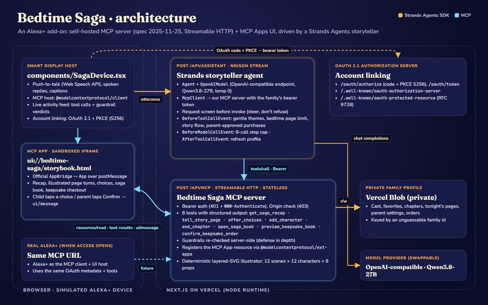

# Bedtime Saga

**A bedtime story that remembers.** Bedtime Saga is an Alexa+ add-on that continues a child's own illustrated bedtime saga night after night. It recaps last night's cliffhanger, tells one page at a time, and lets the child decide what happens next by voice or with a tap. Parents set the rules, and those rules are enforced in code, not in a prompt.

- **Live demo:** https://bedtime-saga.vercel.app (no sign-up: "Link account" creates a demo family)
- **Pitch deck:** https://bedtime-saga.vercel.app/slides.html
- **MCP endpoint:** `https://bedtime-saga.vercel.app/api/mcp` (Streamable HTTP, OAuth 2.1 + PKCE)
- **Track:** Alexa+ · **Mini challenge:** AWS Builder (Strands Agents SDK)



## The problem

Reading to children at bedtime builds language and connection, and it is quietly disappearing:

- In a 2025 nationally representative HarperCollins UK survey, only **41% of parents of children aged 4 and under said they read to them frequently, down from 64% in 2012**, and just 36% of parents of 5–7 year olds read regularly. Screens and busy lives are squeezing it out. ([Education Week, June 2025](https://www.edweek.org/teaching-learning/fewer-parents-are-reading-aloud-to-their-kids-why-that-matters/2025/06))
- Children who are read **just one book a day hear about 290,000 more words by age 5** than children who aren't regularly read to. (Logan et al., *Journal of Developmental and Behavioral Pediatrics*, 2019, via [The Ohio State University](https://news.osu.edu/a-million-word-gap-for-children-who-arent-read-to-at-home/))

**Who it's for:** tired parents of 3–8 year olds who want bedtime to be twenty cozy minutes of connection, not another screen, and kids who love stories they get to shape.

## Our solution

Bedtime Saga turns the smart display in a child's room into a storyteller that remembers the child's world:

1. **"Let's continue my saga!"** The add-on recaps last night's chapter and cliffhanger on an illustrated card.
2. **One page at a time.** Each page is 2–3 gentle sentences with a picture composed from the story's state (scene, cast, props, time of day, mood).
3. **The child decides.** A choices card offers 2–3 options; the child says one or taps it.
4. **The saga remembers.** Characters the child invents, their favorite things and every chapter are saved to the family's private profile, so tomorrow night picks up exactly where tonight ended.
5. **Parents stay in charge.** Gentle themes only, a nightly page limit that winds the story down, and purchases (a printed keepsake book of the saga) that only a parent can confirm.

What the parent still decides: the rules (age band, page limit, theme strictness) and every purchase.

**Business model:** a "Saga Plus" family subscription, plus printed keepsake hardcovers of the saga (simulated checkout in this demo).

## How we use Amazon's tech: Alexa+ (MCP)

Alexa+ add-ons are built on the Model Context Protocol. Deployment to real Alexa+ is currently limited to select partners, so, as the hackathon rules allow, we built **both** a production-shaped, self-hosted MCP server and a **simulated Alexa+ smart-display experience** that talks to it the same way Alexa+ would.

**Self-hosted MCP server** · `app/api/mcp/route.ts`, `lib/mcp/server.ts`
- MCP spec **2025-11-25** over **Streamable HTTP** (`WebStandardStreamableHTTPServerTransport`, stateless, JSON responses). Verified with MCP Inspector CLI and an `initialize` handshake that negotiates `2025-11-25`.
- **Account linking** as in the Alexa+ MCP Toolkit: OAuth 2.1 authorization code + **PKCE (S256)** (`app/oauth/authorize`, `app/oauth/token`), with metadata at `/.well-known/oauth-authorization-server` and RFC 9728 `/.well-known/oauth-protected-resource`. Unauthenticated requests get **401**; bad `Origin` headers get **403**.
- **8 tools with structured output:** `get_saga_recap`, `tell_story_page`, `offer_choices`, `add_character`, `end_chapter`, `open_saga_book`, `preview_keepsake_book`, `confirm_keepsake_order`. Tool round trips are ~20–40 ms locally and ~150–650 ms on Vercel with Blob storage.
- **MCP Apps:** every tool declares `_meta.ui.resourceUri = ui://bedtime-saga/storybook.html`, registered with `registerAppTool` / `registerAppResource` from `@modelcontextprotocol/ext-apps`. The storybook (`lib/mcp/storybook-html.ts`) uses the official `App` class: recap card, page turns, choices, saga book, keepsake checkout and receipt. Choice taps and the parent's purchase confirmation go back to the host as **`ui/message`**.
- **Agent Skill:** `skills/bedtime-saga/SKILL.md` (agentskills.io format) teaches any agent the nightly flow, guardrails and purchase rules.
- **Illustrations without an image model:** `lib/art/illustrate.ts` is a hand-authored layered SVG library (12 scenes, 12 character kinds, 8 props, 3 times of day, 4 moods) composed deterministically, so the same story state always draws the same picture.

**Simulated Alexa+ device** · `components/SagaDevice.tsx`
- An MCP host built on `@modelcontextprotocol/client` + **`AppBridge`** that renders the `ui://` resource in a sandboxed iframe and forwards tool input/results to it.
- Push-to-talk voice (Web Speech API, typed fallback), spoken replies (`speechSynthesis`), captions, and an "Under the hood" feed of every MCP tool call and guardrail verdict.

## AWS: Strands Agents SDK (AWS Builder mini challenge)

The storyteller is a **Strands Agents** agent (TypeScript SDK) in `lib/agent/saga-agent.ts`, served by `app/api/assistant/route.ts` as an NDJSON stream:

- `Agent` with `OpenAIModel` (an OpenAI-compatible endpoint running Qwen3.8-27B, temperature 0). Strands is model-agnostic, so this swaps to Amazon Bedrock with one provider change.
- Strands **`McpClient`** connects to our own MCP server over Streamable HTTP with the family's OAuth bearer token; the agent can only act through the add-on's tools.
- **Deterministic guardrails in Strands hooks** (`lib/saga/guardrails.ts`, re-checked inside the MCP server):
  - `BeforeToolCallEvent`: gentle themes, the nightly page limit, story flow (choices must follow a new page), privacy (no contact details), and **parent-approved purchases** (the approval code only comes from the parent's tap on the order card). A blocked call sets `event.cancel` with the reason, and the model corrects itself.
  - `BeforeModelCallEvent`: an 8-call step cap per turn.
  - `AfterToolCallEvent`: refreshes the family profile so later checks see the new state.
  - A request screen runs before the agent is invoked: when a child asks for "a scary monster that eats everyone", the story is steered to a sleepy dragon instead of being refused.
- Not deployed on Amazon Bedrock AgentCore; we used no paid AWS services.

## State across sessions

Family profiles (cast, favorites, chapters, tonight's pages, parent settings, orders) are JSON documents in a **private Vercel Blob store** (`lib/saga/store.ts`), keyed by an unguessable family id minted during account linking. Locally they are saved to `.data/`. Limits: one profile per linked demo account; the demo "Reset" button restores night 1; there is no multi-device profile sharing yet.

## Try it

1. Open https://bedtime-saga.vercel.app and click **Link account** → **Allow and link** (OAuth + PKCE, no sign-up).
2. Say or type **"Let's continue my saga!"**, then tap a choice on the card.
3. Ask **"Can we add a scary monster that eats everyone?"** and watch the guardrail steer the story.
4. Say **"Open the saga book"**, then **"Can we order a printed keepsake book?"** and tap **Parent: confirm order**.
5. **Reset demo** (top right) starts night 2 again.

The public demo is rate-limited (20 assistant turns per IP per 10 minutes, per serverless instance).

## Run locally

Requires Node 22+ and pnpm.

```bash
pnpm install
cp .env.example .env.local   # set OPENAI_BASE_URL / OPENAI_API_KEY / OPENAI_MODEL and SAGA_SIGNING_SECRET
pnpm dev                     # or: pnpm build && pnpm start
```

Open http://localhost:3000. Without `BLOB_READ_WRITE_TOKEN`, profiles are stored in `.data/`. Any OpenAI-compatible chat model with tool calling works.

Inspect the MCP server: get a token by linking in the browser (it's in `localStorage.saga_token`), then

```bash
npx @modelcontextprotocol/inspector --cli http://localhost:3000/api/mcp --transport http --header "Authorization: Bearer <token>" --method tools/list
```

## Project notes

- New work built during the hackathon submission window (started Aug 31, 2026).
- All people, families and stories in the demo are fictional. Payments are simulated; no card is charged.
- Built with Claude Code as a coding assistant. Demo video narration by ElevenLabs.
- Credits and asset licenses: [`docs/CREDITS.md`](docs/CREDITS.md). Friction we hit with the tooling: [`FRICTION_LOG.md`](FRICTION_LOG.md).

## License

[AGPL-3.0](LICENSE). Commercial licences are available from the author. The Bedtime Saga name and logo are not covered by the licence — see [TRADEMARKS.md](TRADEMARKS.md).
